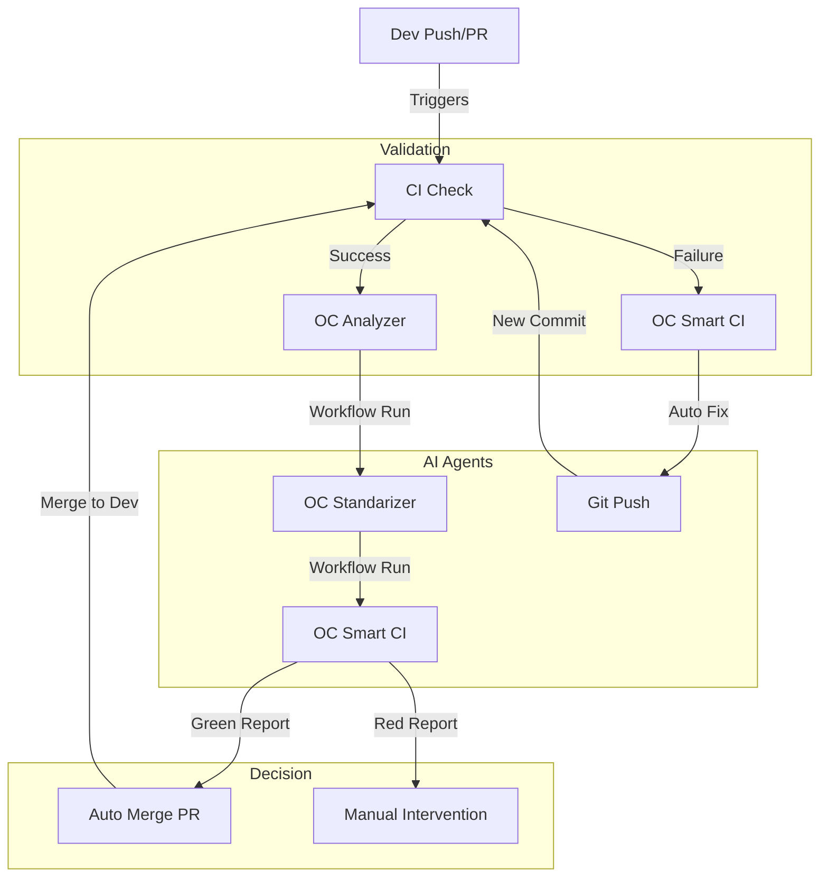

# 🔄 Autonomous AI Workflow System

This document outlines the architecture of the self-healing and self-improving CI/CD pipeline. The system operates as a continuous closed loop, ensuring code quality, automated validation, and autonomous improvements.

## ♾️ The Workflow Loop

---

## 1. ⚖️ CI Check (`ci-check.yml`)
**Role:** The Judge & Source of Truth.  
**Trigger:** Push to `dev`, PR to `dev/main`, Manual Dispatch.

### Tasks:
1.  **Validation**: Runs Typecheck (`tsc`), Linter (`eslint`), Unit Tests (`vitest`).
2.  **Build**: Compiles the Astro/React application for production.
3.  **E2E Testing**: Spins up Postgres & Playwright to run end-to-end smoke tests.
4.  **Reporting**: Generates a detailed **`docs/system-health.md`** report. This report is the "token" passed to all other agents.
5.  **Artifact Sync**: Pushes the health report directly to the `agent-workspace` branch.

---

## 2. 🧠 OC Analyzer (`oc analyzer.yml`)
**Role:** The Brain / Architect.  
**Trigger:** Runs ONLY if `CI Check` completes successfully.

### Agent Persona: **Worldclass Software Architect**
### Tasks:
1.  **Sync**: Merges latest `dev` into `agent-workspace`.
2.  **Context Loading**: Reads `docs/system-health.md` to understand current performance metrics.
3.  **Deep Analysis**: Audits the entire codebase for Stability, Security, Performance, and Modularity.
4.  **Strategic Planning**:
    *   Updates `docs/evaluasi.md` (Scorecard 0-100).
    *   Updates `docs/task.md` with specific, tagged actionable items (e.g., `[UI]`, `[FIX]`, `[ARCH]`).

---

## 3. 👷 OC Standarizer (`oc standarizer.yml`)
**Role:** The Worker / Specialist.  
**Trigger:** Runs after `OC Analyzer` completes.

### Agent Personas:
*   **Frontend & UX Specialist**: Handles `[UI]` tasks. Focus on aesthetics and responsiveness.
*   **Backend & Systems Engineer**: Handles `[FIX]` tasks. Focus on logic, DB, and security.
*   **QA & Architect**: Handles `[ARCH]` tasks. Focus on refactoring and docs.

### Tasks:
1.  **Pick Task**: Reads `docs/task.md` and picks the highest priority task based on available tags.
2.  **Execute**: Writes code, refactors, or fixes issues on `agent-workspace`.
3.  **Commit**: Pushes changes to `agent-workspace`.

---

## 4. 🚦 OC Smart CI (`oc smart-ci.yml`)
**Role:** The Decision Maker (Fixer & Merger).  
**Trigger:** 
*   **Path A (Failure)**: Triggered explicitly by `CI Check` when validation fails.
*   **Path B (Success)**: Triggered by `OC Standarizer` completion.

### Tasks (Path A - Failure):
1.  **Read Report**: Analyzes the RED `system-health.md`.
2.  **Auto-Fix**: Deploys a "Fixer Agent" to chirurgically repair the specific failure (Lint/Test/Logic) without running full suites.
3.  **Push**: Pushes fixes to `agent-workspace` (restarting the loop).

### Tasks (Path B - Success):
1.  **Read Report**: Verifies `system-health.md` is GREEN.
2.  **Pull Request**: Finds existsing PR from `agent-workspace` to `dev`.
3.  **Auto-Merge**: Enables GitHub Auto-Merge (`gh pr merge --auto`). The merge happens only if Branch Protection checks pass.

---

## 📂 Branching Strategy

*   **`dev`**: The main development branch. Protected.
*   **`agent-workspace`**: The shared playground for all AI agents.
    *   `CI Check` pushes reports here.
    *   `Analyzer` audits here.
    *   `Standarizer` commits code here.
    *   `Smart CI` merges FROM here TO `dev`.
